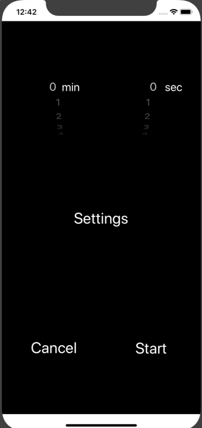
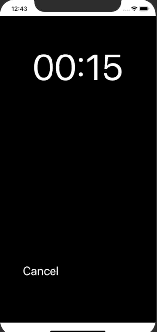

# Random-Interval-Reaction-Timer

A Swift-based timer application.

Users can set various visual/sound stimulus to randomly occur during a timer session. Used for reaction-based interval exercises.  
